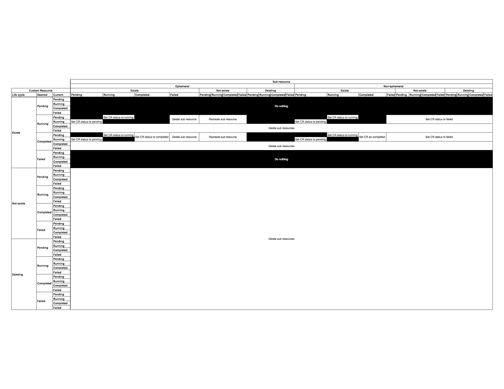

# Reconciliation

This document describes the behavior of the `garbagecollector` library. This
library  is provided for use by all controller implementations.

The garbage collector periodically inspects the desired and current
states of custom resources and their associated sub-resources and takes
action if necessary.

## Concepts:

* **Desired State, Current State**\
  The driving concept of a controller is effectively distilled as, a
  program that takes actions to converge current state toward desired
  state. The controllers in this repository follow the precedent set
  by built-in Kubernetes components, storing desired and current state
  in `.Spec` and `.Status` respectively.

* **Terminal State**\
  This refers to an aspect of the state machine associated with each API
  resource. An FSM is defined by a 3-tuple: a list of its states, an
  initial state, and the conditions for each transition. A
  _terminal state_ is one with no outbound transitions.

* **Pending Resource**\
  A pending resource is one whose current state is a nonterminal
  pre-ready state.

* **Running Resource**\
  A running resource is one whose current state is a nonterminal
  ready state.

* **Completed Resource**\
  A completed resource is one whose current state is a terminal
  successful state.

* **Failed Resource**\
  A failed resource is one whose current state is a terminal
  unsuccessful state.

* **Deleted Resource**\
  The Kubernetes API server does not immediately remove resoures after
  receiving a DELETE request. However, it does set a `deletionTimestamp`
  in the object's metadata. In this document, "deleted" refers to any
  resource with a nonempty `deletionTimestamp`.

* **Does-not-exist Resource**\
  Resources that do not exist are those for which the Kubernetes API
  server returns a `404` status code response for a `GET` request.

* **Ephemeral Resource**\
  An ephemeral resource is one that can be safely recreated if it is in
  a failed state or does not exist.

## Assumptions:

1. Sub-resources associated with a custom resource have a valid
   controller reference set in their object metadata.

1. Sub-resources associated with a custom resource should be torn down
   if the controlling custom resource is in a terminal state.

1. Sub-resource error states are terminal.

1. Sub-resources do not have dependency relationships among each other
   that affect how they must be managed by the controller.

## Behaviors:

_NOTE: These rules apply in order from top to bottom._

| CR desired     | CR status   | Sub-resource status                        | Action                                  |
|:---------------|:------------|:-------------------------------------------|:----------------------------------------|
| Failed         | *           | *                                          | Do nothing.                             |
| *              | Failed      | *                                          | Delete sub-resource.                    |
| Pending        | *           | *                                          | Do nothing.                             |
| *              | Completed   | *                                          | Delete sub-resource.                    |
| Deleting       | *           | *                                          | Delete sub-resource.                    |
| Does not exist | *           | *                                          | Delete sub-resource.                    |
| *              | Running     | Pending, Spec matches                      | Set custom resource state to pending.   |
| *              | Pending     | Running, Spec matches                      | Set custom resource state to running.   |
| *              | *           | Non-terminal, Ephemeral, Spec mismatch     | Update sub-resource.                    |
| *              | *           | Non-terminal, Non-ephemeral, Spec mismatch | Set custom resource state to failed.    |
| *              | *           | Deleting, Ephemeral                        | Do nothing.                             |
| *              | *           | Deleting, Non-ephemeral                    | Set custom resource state to failed.    |
| *              | *           | Does not exist, Ephemeral                  | Recreate the sub-resource.              |
| *              | Running     | Does not exist, Non-ephemeral              | Set custom resource state to failed.    |
| *              | *           | Failed, Ephemeral                          | Recreate the sub-resource.              |
| *              | *           | Failed, Non-ephemeral                      | Set custom resource state to failed.    |
| Running        | *           | Completed                                  | Do nothing.                             |
| Completed      | *           | Completed                                  | Set custom resource state to completed. |

An alternative view of this logic can be seen here: 
